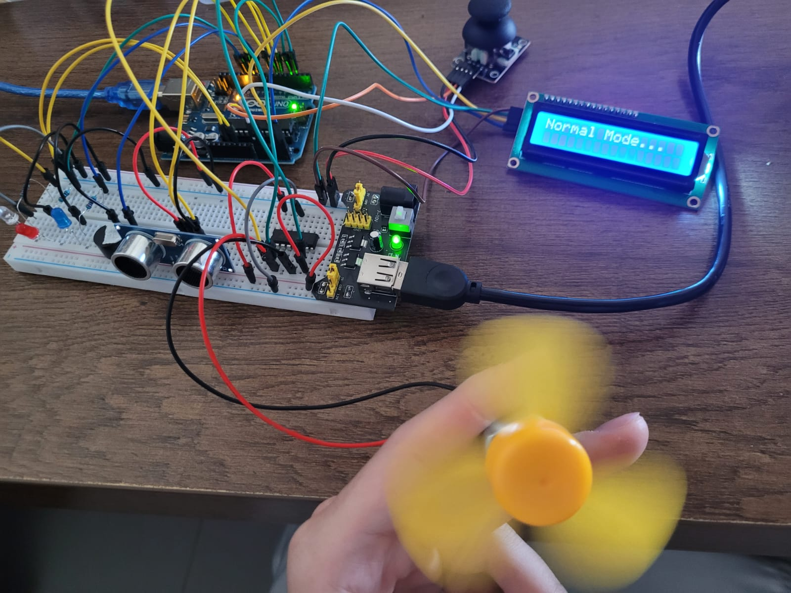
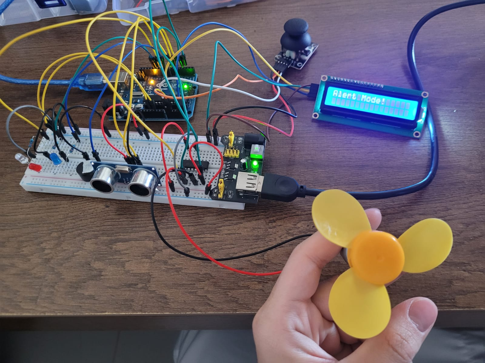
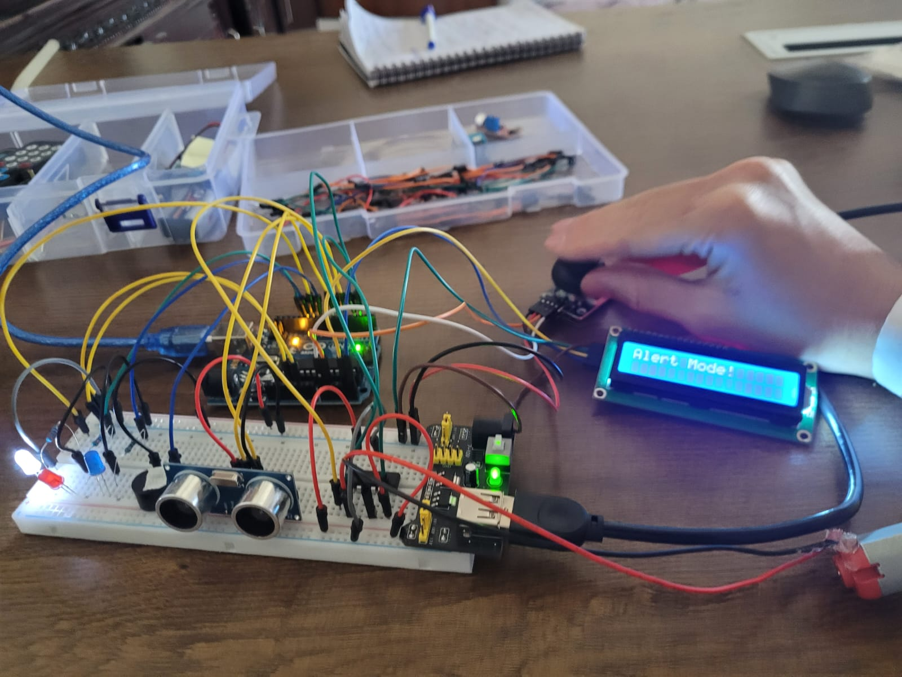
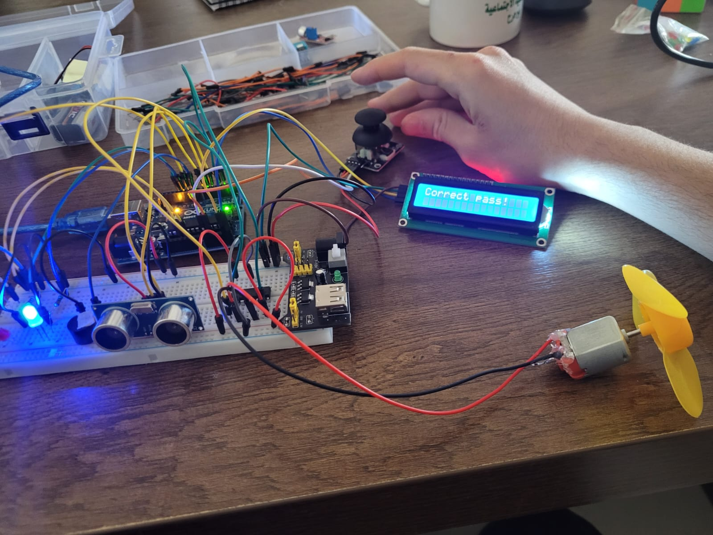
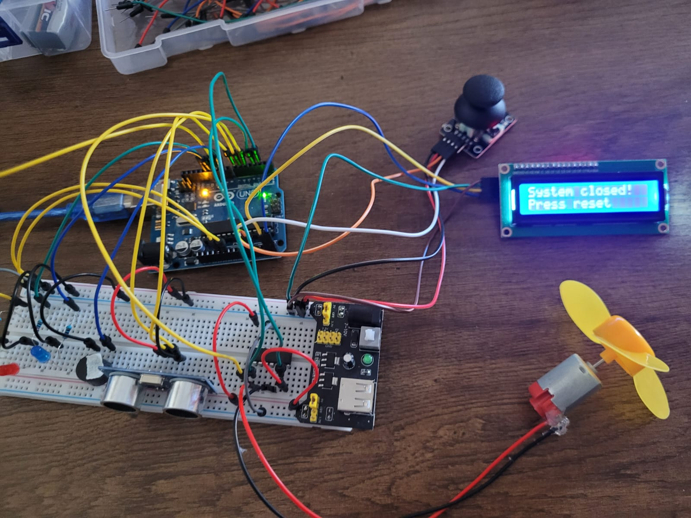

# Arduino---Ultrasonic-Security-System-with-Joystick-Password


# Description:
Arduino---Ultrasonic-Security-System-with-Joystick-Password

This project is a smart security system using an Arduino, an ultrasonic sensor, three LEDs, a buzzer, a DC motor, a joystick, and an LCD display.

At startup, the system operates in Normal Mode, where the ultrasonic sensor is active.

If the ultrasonic sensor detects an object within a certain distance, the system enters Alert Mode.

On the LCD, the message "Alert Mode" is displayed.

The DC motor stops, and user input is required to return to normal.


To exit Alert Mode, the user must enter a specific joystick movement pattern (like a password).

With every joystick movement:

A beep sound is played using the buzzer.

The white LED blinks to indicate the move has been recorded.


🟢 If the entered pattern is correct:

The blue LED turns on.

The system returns to Normal Mode.

The ultrasonic sensor and DC motor resume operation.

---

🔴 If the pattern is incorrect:

The red LED turns on.

The system remains in Alert Mode.


NOTE: The user has only three attempts to enter the correct pattern.

If all attempts fail, the LCD displays "System Locked", and the system remains disabled until the reset button is pressed.


This project simulates a simple intruder alarm system with a secure reset mechanism and is perfect for learning about mode switching, joystick input as password, and system feedback using LEDs, buzzers, and screens.


# Project Pictures:







# Code Below:
```cpp
#include <LiquidCrystal_I2C.h>

LiquidCrystal_I2C lcd(0x27, 16, 2);


byte redLED = 12;
byte blueLED = 11;
byte whiteLED = 10;
byte trig = 7;
byte echo = 6;
byte buzzer = 9;
byte enable = 5;
byte input1 = 3;
byte input2 = 2;
byte count = 0;
byte lifes = 0;
int pinX = A1;
int pinY = A0;

bool alertMode = false;
bool checkDone = true;


byte moves[4];
byte correctMoves[4] = {1,3,1,3};

int analogXread;
int analogYread;

int distance;
unsigned long travelTime;


void gotSignal() {
  for (byte z=0; z<2; z++) {
    digitalWrite(whiteLED, HIGH);
    digitalWrite(buzzer, HIGH);
    delay(70);
    digitalWrite(whiteLED, LOW);
    digitalWrite(buzzer, LOW);
    delay(70);
  }
}


void setup() {
  Serial.begin(9600);
  lcd.init();
  lcd.backlight();
  lcd.clear();
  lcd.setCursor(0,0);
  pinMode(trig, OUTPUT);
  pinMode(echo, INPUT);
  pinMode(buzzer, OUTPUT);
  pinMode(input1, OUTPUT);
  pinMode(input2, OUTPUT);
  pinMode(redLED, OUTPUT);
  pinMode(blueLED, OUTPUT);
  pinMode(whiteLED, OUTPUT);
}

void loop() {
  lcd.clear();
  lcd.print("Normal Mode...");
  digitalWrite(trig, LOW);
  delayMicroseconds(10);
  digitalWrite(trig, HIGH);
  delayMicroseconds(5);
  digitalWrite(trig, LOW);

  travelTime = pulseIn(echo, HIGH);

  distance = (travelTime / 2) * 0.0343;

  if (distance >= 10 && alertMode == false) {
    digitalWrite(input1, HIGH);
    digitalWrite(input2, LOW);
    analogWrite(enable, 120);
  }

  else if (distance < 10 && alertMode == false) {
    alertMode = true;
    digitalWrite(buzzer, HIGH);
    delay(800);
    digitalWrite(buzzer, LOW);
  }


  if (alertMode) { 
    lcd.clear();
    lcd.print("Alert Mode!");

    digitalWrite(input1, LOW);
    digitalWrite(input2, LOW);
    analogWrite(enable, 0);

    analogXread = analogRead(pinX);
    analogYread = analogRead(pinY);

    if (count < 4){
      if (analogXread > 630){
        gotSignal();
        moves[count] = 2;
        count++;
        delay(500);
        }

      if (analogXread < 420){
        gotSignal();
        moves[count] = 4;
        count++;
        delay(500);
        }

      if (analogYread < 420){
        gotSignal();
        moves[count] = 1;
        count++;
        delay(500);
        }

      if (analogYread > 630){
        gotSignal();
        moves[count] = 3;
        count++;
        delay(500);
        }

    }


    else{
      Serial.println(moves[0]);
      Serial.println(moves[1]);
      Serial.println(moves[2]);
      Serial.println(moves[3]);
      for (byte i=0; i<4; i++) {
        if (moves[i] != correctMoves[i]) {
          checkDone = false;
          break;
        }
      }

      if (checkDone) {
        lcd.clear();
        lcd.print("Correct pass!");
        digitalWrite(blueLED, HIGH);
        digitalWrite(buzzer, HIGH);
        delay(1500);
        digitalWrite(blueLED, LOW);
        digitalWrite(buzzer, LOW);

         alertMode = false;
      }

      else{
        
        lcd.clear();
        lcd.print("Wrong!");
        for (byte time=0; time<2; time++) {
        digitalWrite(redLED, HIGH);
        digitalWrite(buzzer, HIGH);
        pinMode(enable, OUTPUT);
        delay(300);
        digitalWrite(redLED, LOW);
        digitalWrite(buzzer, LOW);
        delay(300);
        }

        lifes++;
        

        if (lifes == 3){
          while (true){
            lcd.clear();
            lcd.print("System closed! ");
            lcd.setCursor(0, 1);
            lcd.print("Press reset");
            delay(1000);
          }
        }

        
      }

      count = 0;
      checkDone = true;
      
      for (byte z=0; z<4; z++) {
        moves[z] = 0;
      }

  }


  } // End alert Mode

  delay(200);
}
```
